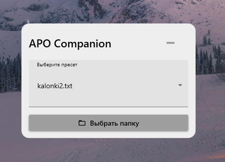
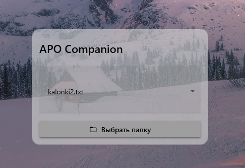
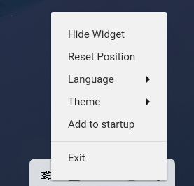

# APO Companion

[Русская версия](README_ru.md)

A compact and stylish widget for the Windows desktop that allows you to quickly switch between configuration files (presets) for Equalizer APO.

## 🚀 Features

-   **Quick Switching:** Select equalizer presets directly from your desktop.
-   **Stylish Interface:** A modern design that looks great on any wallpaper.
-   **Multilingual Support:** The interface is available in English and Russian.
-   **Tray Control:** Hide and show the widget or manage it through the system tray icon.
-   **Recent Presets List:** Quickly access your most recently used configurations right from the tray menu.
-   **Easy Startup Management:** Add or remove the application from Windows startup with a single click.
-   **Customizable Transparency:** The widget is semi-transparent and becomes opaque on mouse hover.
-   **Smart Setup:** Automatically finds Equalizer APO or asks for the path if it's installed in a non-standard location.

## ⚙️ Requirements

-   Windows 10 / 11 (should also work on Windows 7 / 8)
-   .NET Desktop Runtime 8 (or newer) to build from source
-   [Equalizer APO](https://sourceforge.net/projects/equalizerapo/) installed

## 📝 How to Use

1.  Go to the [Releases](https://github.com/shumik11/APO-Companion/releases/tag/Main) page.
2.  Download the latest version.
3.  Run the application.

On the first launch, the application will ask you to specify the path to Equalizer APO's `config.txt` file. Then, you can select the folder where your preset `.txt` files are stored.

## ❓ Frequently Asked Questions (FAQ)

**Q: I selected a folder, but nothing appeared in the presets list. Why?**

**A:** Make sure the folder you selected contains files with the `.txt` extension. The application only looks for these. Also, check that you have permission to read files in that directory. If there are presets in the folder but the list is empty, try restarting the application.

---

**Q: The application didn't find `config.txt` automatically. Where can I find it?**

**A:** Typically, `config.txt` is located in the Equalizer APO installation folder. The default path is:
`C:\Program Files\EqualizerAPO\config\config.txt`
If you installed Equalizer APO on a different drive or in another folder, look for it there. For example: `D:\MyPrograms\EqualizerAPO\config\config.txt`.

---

**Q: Can I edit presets directly from the widget?**

**A:** No. The widget is designed only for quickly switching between existing `.txt` files. To edit presets, use the standard Equalizer APO `Configuration Editor.exe`.

---

**Q: The widget disappeared/won't appear on the screen, but the tray icon is there. What should I do?**

**A:** The widget has likely moved off-screen. This can happen if you change your display resolution or monitor configuration.

To get it back, simply right-click the application icon in the system tray and select **"Reset Position"**. The widget will instantly reappear in the center of your main screen.

## 📄 License

This project is licensed under the MIT License. See the [LICENSE](LICENSE) file for details.
