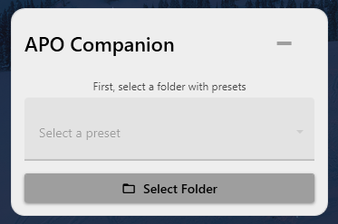
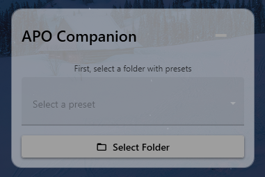

# APO Companion

  
  

Компактный и стильный виджет для рабочего стола Windows, позволяющий быстро переключаться между конфигурационными файлами (пресетами) для Equalizer APO.

| Активный режим | Неактивный режим | Меню в трее |
| :---: | :---: | :---: |
|  |  |  |
| _Виджет становится непрозрачным в фокусе._ | _Виджет становится полупрозрачным, когда неактивен._ | _Быстрый доступ ко всем функциям из трея._ |

## 🚀 Возможности

-   **Светлая и тёмная темы:** Настройте виджет под оформление вашего рабочего стола.
-   **Автообновление пресетов:** Список обновляется сам, если вы добавляете или удаляете файлы в папке.
-   **Быстрое переключение:** Выбирайте пресеты эквалайзера прямо с рабочего стола.
-   **Стильный интерфейс:** Современный дизайн, который отлично смотрится на любых обоях.
-   **Поддержка нескольких языков:** Интерфейс доступен на русском и английском языках.
-   **Управление из трея:** Скрывайте и показывайте виджет через иконку в системном трее.
-   **Удобное управление автозапуском:** Добавляйте приложение в автозагрузку Windows одним кликом.
-   **Умная настройка:** Автоматически находит установленный Equalizer APO.

## 📥 Установка

Установка не требуется! Приложение **портативное**.

1.  Перейдите на [**страницу релизов**](https://github.com/shumik11/APO-Companion/releases).
2.  Скачайте `.exe` файл из последнего релиза.
3.  Запустите его.

При первом запуске приложение попросит указать путь к файлу `config.txt` от Equalizer APO. Затем вы сможете выбрать папку, где хранятся ваши `.txt` файлы с пресетами.

## ⚙️ Системные требования

-   Windows 10 / 11
-   Установленный [Equalizer APO](https://sourceforge.net/projects/equalizerapo/)

#### Для разработчиков (сборка из исходного кода)
-   SDK и Desktop Runtime для .NET 8
-   Visual Studio 2022

## ❓ Часто задаваемые вопросы (FAQ)

**В: Я выбрал папку, но в списке пресетов ничего не появилось. Почему?**

**О:** Убедитесь, что в выбранной вами папке есть файлы с расширением `.txt`. Приложение ищет только их. Также проверьте, что у вас есть права на чтение файлов в этой директории. Если в папке есть пресеты, но список пуст, попробуйте перезапустить приложение.

---

**В: Приложение не нашло `config.txt` автоматически. Где его искать?**

**О:** Обычно `config.txt` находится в папке установки Equalizer APO. Стандартный путь:
`C:\Program Files\EqualizerAPO\config\config.txt`
Если вы устанавливали Equalizer APO на другой диск или в другую папку, ищите его там. Например: `D:\MyPrograms\EqualizerAPO\config\config.txt`.

---

**В: Могу ли я редактировать пресеты прямо из виджета?**

**О:** Нет. Виджет предназначен только для быстрого переключения уже созданных `.txt` файлов. Для редактирования пресетов используйте стандартный редактор конфигурации Equalizer APO (`Configuration Editor.exe`).

---

**В: Виджет исчез/не появляется на экране, но иконка в трее есть. Что делать?**

**О:** Скорее всего, виджет "улетел" за пределы экрана. Это может произойти, если вы меняли разрешение или конфигурацию мониторов. Чтобы вернуть его, просто кликните правой кнопкой мыши по иконке приложения в системном трее и выберите пункт **"Сбросить положение"**. Виджет мгновенно появится в центре вашего основного экрана.

## 📄 Лицензия

Этот проект распространяется под лицензией MIT. Подробности смотрите в файле [LICENSE](LICENSE).
